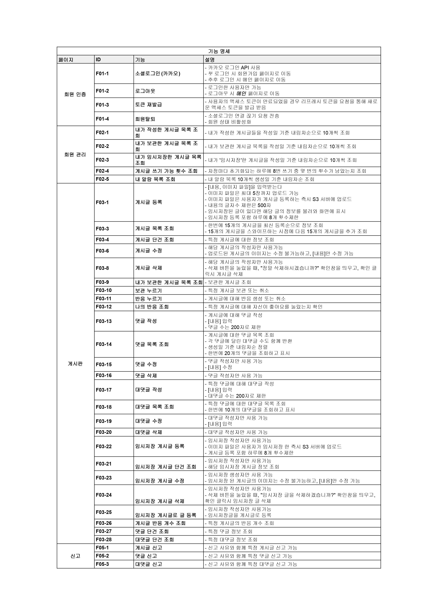
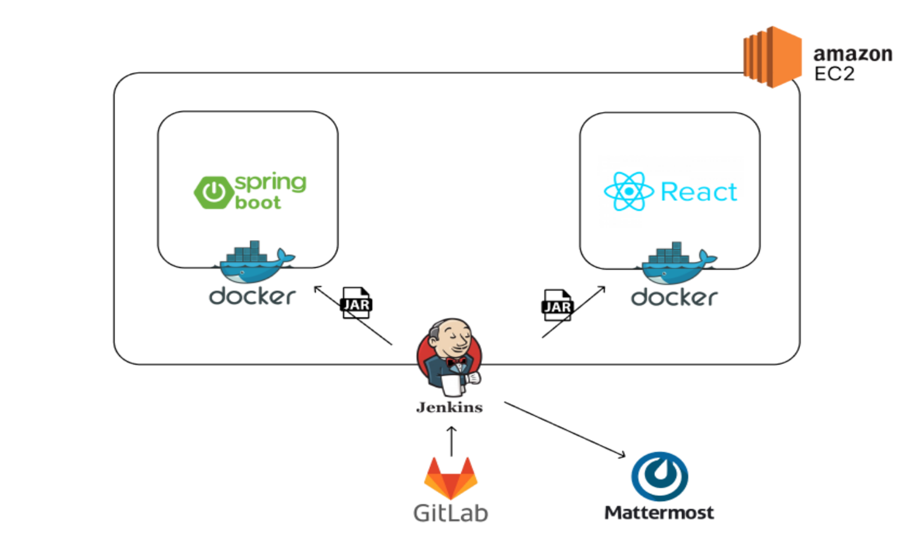

# Forest of Pandora

## Index
  - [Introduction](#introduction) 
  - [Technical Stacks](#technical-stacks)
  - [Features](#features)
  - [Documentation](#documentation)
  - [Team](#team)
 

## Introduction
### Overview
Pandora's Forest is an anonymous post-sharing service that anyone can use without hesitation.  
Our team believes that many users want to share their trivial and secret stories and seek empathy. However, existing social media platforms require users to use fixed nicknames or share their IDs with people around them, making it difficult to guarantee complete anonymity. Moreover, traditional social media often favors users with a larger number of followers, leading to better communication and significant influence on the platform.  
Therefore, we aim to create a post-sharing platform where users can share their stories and seek empathy without any burden by assigning random nicknames to each post and eliminating the need for followers or following.

<!--
판도라의 숲은 누구나 부담없이 사용할 수 있는 익명 글 공유 서비스입니다.  
저희 팀은 자신의 사소하고 비밀스러운 이야기를 공유하고 공감받고 싶어하는 사용자가 많지만  기존의 SNS는 고정된 닉네임을 사용하거나 주변 사람들과 ID를 공유하며 사용하기 때문에 완벽한 익명성을 보장하기 힘들다고 생각했습니다. 또한 기존의 SNS는 자신의 팔로우 하는 사람이 많을수록 소통이 더 잘 이루어지고, 해당 플랫폼에 영향을 많이 끼치고 있습니다.  
따라서 저희는 자신의 이야기를 공유하고 공감받고 싶어하는 사용자가 부담없이 사용할 수 있도록 글 마다 랜덤닉네임을 부여하고 팔로우/팔로워가 없는 글 공유 플렛폼을 만들고자 합니다.
-->

### Duration and Team
Duration: 2024. 01. 08 - 2024. 04. 16 (6 weeks)  
Team: 6 members

 

## Technical Stacks
|  |  |
|----|---|
| **FE** |    |
| **BE** |    |
| **Infra** |     |
| **IDE** | -3178C6?style=flat&logo=v&logoColor=white) -F23920?style=flat&logo=intellij&logoColor=white) |
| **Tools** |      |

 

[back to top](#index)
 

## Features

### Sign Up and Login

| GIF | Description |
| :---: | :--- |
|  | **Browse Posts Without Signing Up**      - Users can browse posts without signing up. - To use features like commenting, liking, and saving, logging in is required.     **Login**   - Utilizes the Kakao Login API. - Upon first login, users are automatically signed up, and they can log out or delete their account afterward.|

### Viewing Posts, Liking, and Saving

| GIF | Description |
| :---: | :--- |
|  | **Viewing Posts**      - Posts are displayed in a short format using infinite scroll. - Users can see the content, images, profile pictures, nicknames, posting dates, save status, like status, number of likes, and number of comments. - Clicking the image enlargement icon in the upper right corner of the post allows users to view the associated images. - Inappropriate posts can be reported using the report button.    **Liking Posts**      - Users can increase the like count for posts they resonate with by clicking the like button.    **Saving Posts**     - Users can save posts they like by clicking the bookmark button. - Saved posts can be accessed in the My Page section.|

### Registering, Editing, Deleting, and Temporarily Saving Posts

| GIF | Description |
| :---: | :--- |
|  | **Registering Posts**      - Users can register post content and images. - A maximum of 5 images can be uploaded, and the text is limited to 500 characters. - A new nickname and profile picture are randomly assigned each time a post is registered.    **Editing Posts**      - Users can edit their own posts. - Text is limited to 500 characters.    **Deleting Posts**    - Users can delete their own posts.    **Temporarily Saving Posts**     - Users can temporarily save a post they are writing and retrieve it later. - Images can also be temporarily saved.|

### Comments and Replies

| GIF | Description |
| :---: | :--- |
|  | **Comments**      - Each post displays random nicknames and profile pictures for comments. - When a comment is made, the post author receives a notification. - Inappropriate comments can be reported using the report button. - Users can edit and delete their own comments.    **Replies**      - Users can reply to existing comments. - When a reply is made, the original comment's author receives a notification. - Inappropriate replies can be reported using the report button. - Users can edit and delete their own replies.|

### My Page

| GIF | Description |
| :---: | :--- |
|  | **My Posts**      - Users can view their posts in descending order by the date of writing. - They can check post content, images, posting dates, like counts, and comment counts.    **My Saved Posts**      - Users can view a list of their saved posts in descending order by date. - They can check post content, images, posting dates, and author nicknames.|

[back to top](#index)
 

## Documentation

### Porting Guide (exec)
👉 [Porting Guide](https://github.com/Ivvi-a/Forest-of-Pandora/tree/main/exec)  

### Wireframe
👉 [Figma](https://www.figma.com/design/4yc4GtoT9B4qryWfcK7Scu/%ED%8C%90%EB%8F%84%EB%9D%BC%EC%9D%98-%EC%88%B2?node-id=0-1)

### API Spec
👉 [Notion](https://pumped-square-544.notion.site/API-deac3f36a1ad4c68ac427c155cb63c1e)

### Fuctional Spec

### ERD

### System Architecture

[back to top](#index)
 

## Team
|  김성재  |  안성재  |  유호정  |  윤정인  |  이서윤  |  조연주  |
| --- | --- | --- | --- | --- | --- |
|  |  | 
 |  |  |  |
| Backend / Infra | Backend | Frontend | Backend | Frontend | Frontend |
